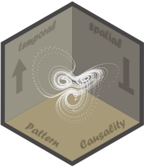

# pc

<!-- badges: start -->

<!-- [](https://CRAN.R-project.org/package=pc)
[](https://CRAN.R-project.org/package=pc)
[](https://cran.r-project.org/web/checks/check_results_pc.html)
[](https://CRAN.R-project.org/package=pc)
[](https://CRAN.R-project.org/package=pc)
[](http://www.gnu.org/licenses/gpl-3.0.html)
[](https://lifecycle.r-lib.org/articles/stages.html#experimental) -->
[](https://github.com/stscl/pc/actions/workflows/R-CMD-check.yaml)
[](https://stscl.r-universe.dev/pc)

<!-- badges: end -->

<a href="https://stscl.github.io/pc/"></a>

<p align="right"; style="font-size:11px">logo by layeyo</p>

***P**attern **C**ausality Analysis*

*pc* is an R package for pattern-based causality analysis in both time
series and spatial cross-sectional data. It uses symbolic pattern
representations and cross mapping to detect directional interactions 
and infer causal structure from temporal dynamics and spatial snapshots. 
Built on a high-performance C++ backend with a lightweight R interface, *pc*
provides efficient and flexible tools for data-driven causality analysis.

> *Refer to the package documentation <https://stscl.github.io/pc/>
> for more detailed information.*

## Installation

- Install from [CRAN](https://CRAN.R-project.org/package=pc) with:

``` r
install.packages("pc", dependencies = TRUE)
```

- Install binary version from
  [R-universe](https://stscl.r-universe.dev/pc) with:

``` r
install.packages("pc",
                 repos = c("https://stscl.r-universe.dev",
                           "https://cloud.r-project.org"),
                 dependencies = TRUE)
```

- Install from source code on [GitHub](https://github.com/stscl/pc)
  with:

``` r
if (!requireNamespace("pak")) {
    install.packages("pak")
}
pak::pak("stscl/pc", dependencies = TRUE)
```
